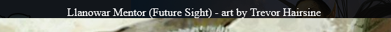
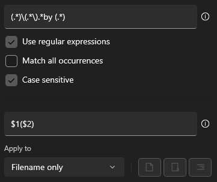

# proxy-stuff
stuff for MTG proxies. 
 

# Custom CSS to hide the "Permalink" text on MTGpics.com



To use, install a browser extension like [Stylus](https://addons.mozilla.org/en-US/firefox/addon/styl-us/), go to [mtgpics](https://mtgpics.com) and create a new style by clicking on the Stylus icon. Then paste this snippet in. Remember to save.

```css
.CardW16 > div {
    display: none !important;
}
```

# Regular Expression to rename mtgpics art to "proxy format"



Matches the card name and artist name from the mtgpics title. Use with a program like [PowerRename](https://docs.microsoft.com/en-us/windows/powertoys/powerrename). (Comes with Microsofts [PowerToys](https://docs.microsoft.com/en-us/windows/powertoys/install))

eg. `Llanowar Mentor (Future Sight) - art by Trevor Hairsine` turns into `Llanowar Mentor (Trevor Hairsine)`

Matching pattern: 

```regex
(.*)\(.*\).*by (.*)
```

or if you don't have the custom css to hide "Permalink" and you keep copying it accidentally:

```regex
(.*)\(.*\).*by (.*)Permalink
```

Substitution pattern

```regex
$1($2)
```

# Disclaimer: the following are NOT functional pieces of software

Please for the love of god use MrTeferi's [MTG-Art-Downloader](https://github.com/MrTeferi/MTG-Art-Downloader). I only made these scripts because the [Art Downloader](https://github.com/MrTeferi/MTG-Art-Downloader) could not get the english printing art for the Strixhaven Mystical Archive cards. So only use these scripts when the [Art Downloader](https://github.com/MrTeferi/MTG-Art-Downloader) doesn't work. Thanks.

## PowerShell script to download an entire set from MTGpics.com

This script is very basic and requires you to manually edit the code. It's setup to download all of the english Strixhaven Mystical Archive arts. To use, copy the script and save it as a .ps1 file. It will download all images to the folder the script is in.

```ps1
Set-Location -Path $PSScriptRoot

function New-ArtURL {
    param ([string]$n)
    $padded = ([string]$n).PadLeft(3, '0')
    return "https://www.mtgpics.com/pics/art/stm/$padded.jpg"
}

$client = new-object System.Net.WebClient

for (($i = 1); $i -lt 64; $i++) {
    $url = New-ArtURL -n $i
    $client.DownloadFile($url, ".\$i.jpg")
}
```

I also have a script to rename all of the "001.jpg" images to "proxy format" and this one is even worse to use.

```ps1
$names = @(
    "Approach of the Second Sun (Minttu Hynninen)",
    "Day of Judgment (Anato Finnstark)",
    "Defiant Strike (Dominik Mayer)",
    "Divine Gambit (Matthew G. Lewis)",
    "Ephemerate (Rovina Cai)",
    "Gift of Estates (Justin Hernandez & Alexis Hernandez)",
    "Gods Willing (Dominik Mayer)",
    "Mana Tithe (Robbie Trevino)",
    "Revitalize (Justin Hernandez & Alexis Hernandez)",
    "Swords to Plowshares (Mark Tedin)",
    "Teferi's Protection (Minttu Hynninen)",
    "Blue Sun's Zenith (Dominik Mayer)",
    "Brainstorm (Justin Hernandez & Alexis Hernandez)",
    "Compulsive Research (Kristina Collantes)",
    "Counterspell (Olena Richards)",
    "Memory Lapse (Kristina Collantes)",
    "Mind's Desire (Minttu Hynninen)",
    "Negate (Dominik Mayer)",
    "Opt (Kristina Collantes)",
    "Strategic Planning (Robbie Trevino)",
    "Tezzeret's Gambit (Jason Felix)",
    "Time Warp (Dominik Mayer)",
    "Whirlwind Denial (Anato Finnstark)",
    "Agonizing Remorse (Robbie Trevino)",
    "Crux of Fate (Jason Felix)",
    "Dark Ritual (Robbie Trevino)",
    "Demonic Tutor (Anato Finnstark)",
    "Doom Blade (Matthew G. Lewis)",
    "Duress (Kristina Collantes)",
    "Eliminate (Rovina Cai)",
    "Inquisition of Kozilek (Matthew G. Lewis)",
    "Sign in Blood (Minttu Hynninen)",
    "Tainted Pact (Benjamin Ee)",
    "Tendrils of Agony (Rovina Cai)",
    "Village Rites (Matthew G. Lewis)",
    "Chaos Warp (Anato Finnstark)",
    "Claim the Firstborn (Anato Finnstark)",
    "Faithless Looting (Carly Mazur)",
    "Grapeshot (Minttu Hynninen)",
    "Increasing Vengeance (Dominik Mayer)",
    "Infuriate (Benjamin Ee)",
    "Lightning Bolt (Anato Finnstark)",
    "Mizzix's Mastery (Olena Richards)",
    "Shock (Dominik Mayer)",
    "Stone Rain (Justin Hernandez & Alexis Hernandez)",
    "Thrill of Possibility (Minttu Hynninen)",
    "Urza's Rage (Dominik Mayer)",
    "Abundant Harvest (Barbara Rosiak)",
    "Adventurous Impulse (Minttu Hynninen)",
    "Channel (Kristina Collantes)",
    "Cultivate (Jason Felix)",
    "Harmonize (Carly Mazur)",
    "Krosan Grip (Minttu Hynninen)",
    "Natural Order (Anato Finnstark)",
    "Primal Command (Olena Richards)",
    "Regrowth (Minttu Hynninen)",
    "Snakeskin Veil (Anato Finnstark)",
    "Weather the Storm (Justin Hernandez & Alexis Hernandez)",
    "Despark (Mark Tedin)",
    "Electrolyze (Dominik Mayer)",
    "Growth Spiral (Barbara Rosiak)",
    "Lightning Helix (Minttu Hynninen)",
    "Putrefy (Minttu Hynninen)"
)

Get-ChildItem -Filter *.png | 
Foreach-Object {

    $ext = $_.Extension
    $name = $_.Basename

    $n = $names[(([int]$name) - 1)]
    $newName = "$n$ext"

    Rename-Item $name$ext -NewName $newName

}
```

You might notice the giant array of card names there, and yeah, you need to get those yourself for the set you downloaded. 

How I got the Mystical Archive card names in order: 

1. Search for the set on scryfall, eg. `set:sta`
2. Switch to "checklist" view
3. Copy all of the card info
4. Paste into a spreadsheet program like Libre Calc
5. Remove the useless columns and add columns with ( and ) to the left and right of the artist column
6. Copy all of the card names into VS Code and use multi-cursor mode to add the `""` and `,` (this can also be done in the spreadsheet program ig)
7. Use the search and replace function in VS Code or Notepad++ to make all the tab characters into space characters
8. Wrap the list in the PowerShell array constructor `$names = @(` and `)`

There must be a better way but I have not found it. (Well I have but it would require some development and Scryfall API ingestion that I'm just not doing thanks)

Since you've come this far, you might be interested in knowing that mtgpics.com is sometimes just plain WRONG with their numbering. I can't remember which card it was but the number on scryfall (and on the card) did not match mtgpics card number or even the set. This might be because cards have multiple printings.

So anyways I recommend just using the first two snippets on this page and downloading the art manually + PowerRename. There's also no quarantee that all of the images on mtgpics are .jpg so the script might even miss some of them. Have fun!
